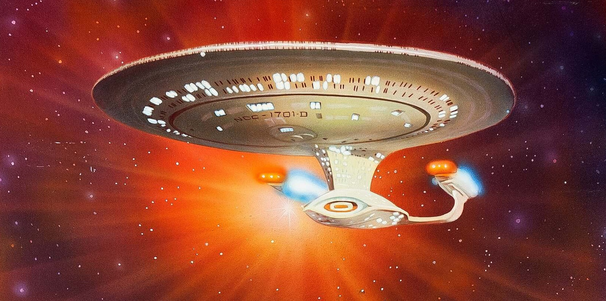
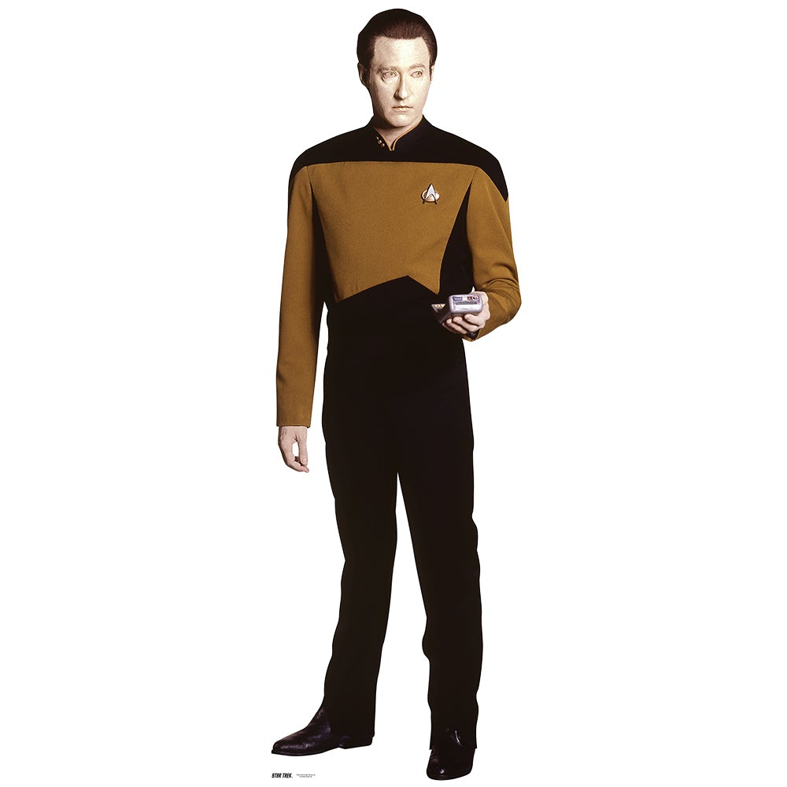

[Back](https://monip1.github.io/fun-things/Chaos/)

Star Trek: The Next Generation, is a tv series set in the 24th century.
The ship is the Enterprise D, designation NCC 1701-D, and is the 5th starship to bear the name "Enterprise".

The only character you need to know is an operations manager who holds the rank of Lieutenant Commander Data. He is an android with phenomenal strength and speed, though is always striving to be more human.
