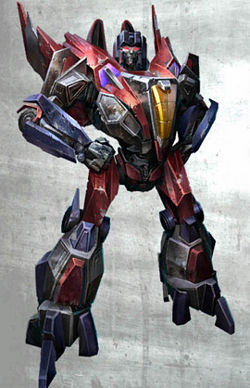
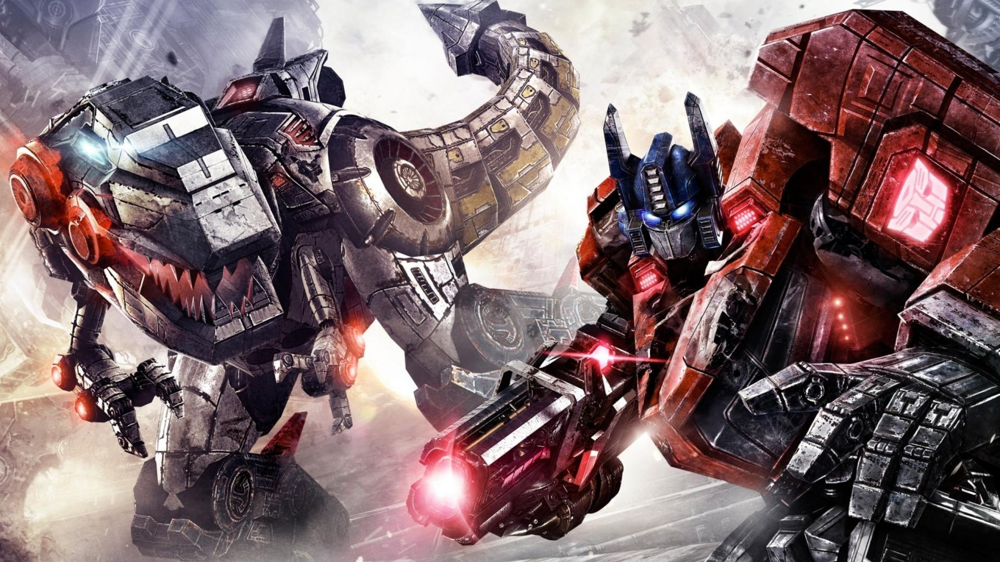

# Congrats 
## You have been granted permission to witness Yeosang in clout glasses.

Oh NO! Starscream's come to kidnap him and take him to Kaon.

 

Yunho fights back with a finger heart and Starscream is stunned, but not for long.

He was stunned just long enough for Grimlock and Optimus to arrive at the scene.

Starscream sends a call for backup from the Decepticons, but the signal is detected by Data on the Enterprise!

A confused Megatron arrives with his Decepticons at the scene but is unable to establish communications with Starscream to ascertain why he is trying to capture a mere one tiny human.

The Enterprise sails in at Warp 9.5 and the Nemesis detects the new ship and leaves it's decepticons on the surface to fight the Enterprise.

The Enterprise's weapon systems are no match for the Nemesis, but they are able to flee at warp 4 and recover behind Jupiter.

Meanwhile. Straykids have arrived to Yeosang's aid. With them, comes Felix and his infinite supply of eggs from his mysterious friend. Optimus, now armed with Felix's eggs, bury's Starscream in a sea of egg.

 Optimus's rifle was not designed for eggs, so it is now clogged full of yolk and not functioning. Megatron and his army must now rescue Starscream from a yolky demise.

 
 
 Megatron, unable to communicate with the buried Starscream, asks Optimus why Starscream wanted the human, but Optimus also does not know.

 
 
 Grimlock, uninformed that the fighting has paused, eats a decepticon soldier.

 
 
 Thankfully, as the sides are about to resume fighting, sleepy Hongjoong shows up, and his exhausted prescense causes both sides to fall unconscious -- he steals their sleep.

 
 
 The Enterprise returns, having mostly recovered, and Starscream digs out of the little remaining egg, and the two sides. The sleepyness starts to reach him, but he fights it to reach the building holding Yeosang before also falling asleep.

 
 
 Seonghwa arrives to wake up his sleepy friend, which allows the others to slowly regain consciousness.

 

Starscream, now faced with friends, enemies, and strangers, must answer for his actions.
He was never after Yeosang, he just wanted the glasses.

Yeosang gives Starscream his second set of clout glasses and everyone parts ways, happily.

Thank you, now I need sleep, 
